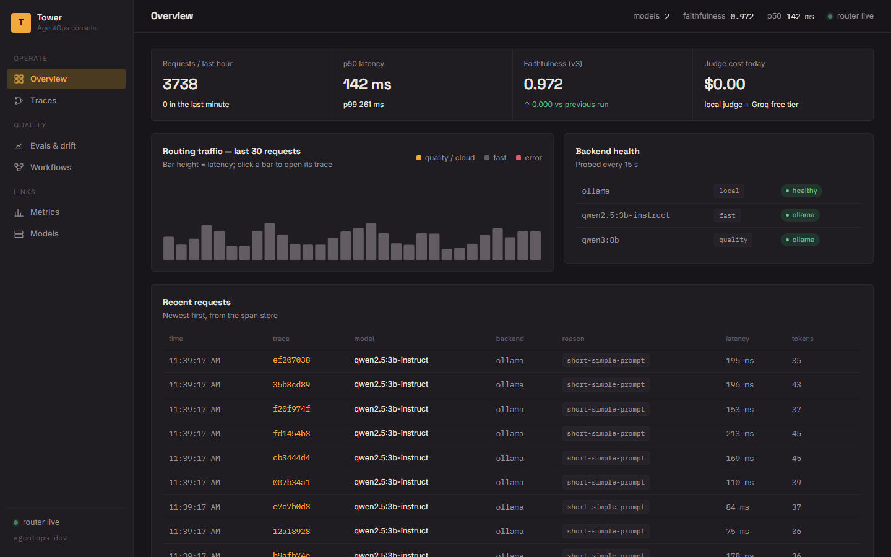
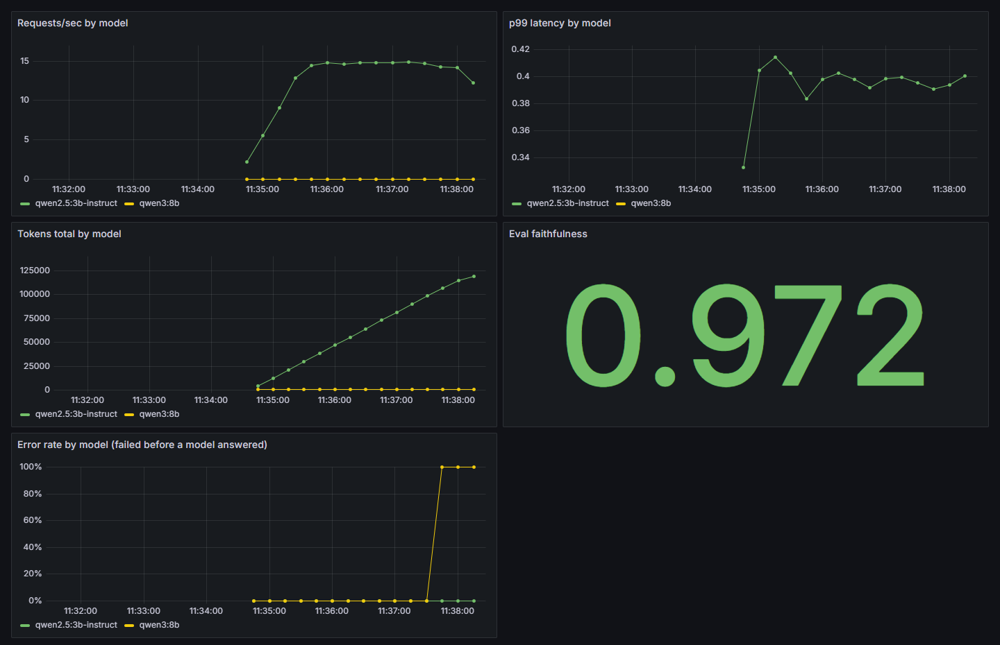

# AgentOps

[](https://github.com/yosrikhiari/AgentOps/actions/workflows/ci.yml) [](https://github.com/yosrikhiari/AgentOps/releases) 

A self-hosted **LLM operations gateway** in one Go binary: an OpenAI-compatible **router** over local and cloud models, a **durable task tracker**, a **faithfulness eval + drift alert** loop, **OTel-shaped traces**, an **MCP server** for AI assistants, and the **Tower console** for humans.

Built solo, on an RTX 4060 (8 GB VRAM), against local [Ollama](https://ollama.com) models — informed by how TensorZero, Bifrost, Temporal and Langfuse solve the same problems, but with every core piece written here so it can be explained line by line. Standard library + one dependency (`pgx`).

```
                     ┌──────────────────────────── agentops (one binary) ────────────────────────────┐
  OpenAI clients ──► │ router: auth (API keys) → Classify → Plan (fail-closed) → Backend            │
  POST /v1/chat      │         Ollama /api/chat (stream) · any OpenAI-style API · health prober      │
                     │         ├─ Prometheus /metrics (hand-written exposition)                       │
                     │         └─ 3 spans per chat ──► async writer ──► Postgres spans                │
  --run-tracker ───► │ tracker: Researcher → Drafter → Reviewer, row-status durability, kill -9 safe  │
  --score ─────────► │ evals: pgvector top-k → split answer into claims → LLM judge → faithfulness    │
                     │        eval_runs + eval_pair_scores → drift report + alert                     │
  Claude Desktop ──► │ mcp (--mcp): list_models · get_stats · route_test_request · inspect_trace ·    │
                     │             get_drift_report  (JSON-RPC 2.0 over stdio)                       │
  browser  /  ─────► │ Tower console: overview · traffic · backend health · trace inspector ·         │
                     │                evals & drift · workflows · cockpit   (embedded, no build step)   │
                     └───────────────────────────────────────────────────────────────────────────────┘
```



<sub>Tower, the console embedded in the binary (no build step): the same k6 run seen from the span store — 3,738 requests in the hour, p50 142 ms / p99 261 ms, every request routed with its reason and traceable. The [Evals & drift page](docs/img/tower-evals.png) shows the golden v3 history against the 0.70 alert threshold and the worst-scoring pairs of the latest run.</sub>



<sub>The provisioned Grafana board during a 5-minute k6 run on 2026-09-19 (2 VUs of short prompts routed to `qwen2.5:3b-instruct`, 1 VU of long prompts routed to `qwen3:8b`): 3,737 requests, 1 failure — the quality-tier request that hit the 180 s client timeout, which is the 100 % error step on the yellow line. Faithfulness 0.972 is the golden v3 suite (72 pairs) scored minutes earlier with `--score`.</sub>

**Current release: [v1.0.0](https://github.com/yosrikhiari/AgentOps/releases/tag/v1.0.0)** — 68 tests, `go vet` + `-race` + `staticcheck` + `govulncheck` in CI, plus 11 **executable policies** that fail the build when a rule in [`docs/RULES.md`](docs/RULES.md) is broken. See [`CHANGELOG.md`](CHANGELOG.md).

## What it does

| Capability | Where | Proof |
|---|---|---|
| Route chat requests between a fast and a quality local model on a rule you can read, with a cloud fallback that is *never* used for sensitive data | `router/` | `reason` on every response; `TestSensitiveNeverLeavesBox` |
| Speak the OpenAI chat shape, streaming included, to any client library | `router/server.go` | `TestOpenAIShape`, `TestStreamSSE`; [`docs/API.md`](docs/API.md) |
| Virtual API keys with per-minute limits and token budgets | `router/keys.go`, `--create-key` | live 200/429/429/429 on a 2-rpm key |
| Hand-written Prometheus exposition + Tower-native dashboard panels (per-model counts, p50/p99, tokens, error rate) | `router/metrics.go`, `console/` `#/overview` | k6: 0/2725 failed at 50 RPS, p99 70 ms |
| Keep a multi-step agent alive through `kill -9` and resume without repeating work | `tracker/` | `TestKillResume` + a recorded live kill |
| Score answers claim-by-claim against retrieved sources, store every run, alert on drift | `evals/` | golden v3 (72 pairs) **0.972** — 70/70 faithful where retrieval hit, 2 retrieval misses; v2 (48) 1.000 |
| One trace per request: `trace_id / span_id / parent_id`, prompts never stored | `GET /v1/traces/{id}`, `--trace`, MCP | 3 chained spans per chat |
| Let Claude (or any MCP client) ask "which model handled the most traffic?" | `mcp/` | 5 tools, live handshake |
| Show it all to a human and let them run an eval or resume a workflow | `console/` → `http://localhost:8080` | verified page by page in the browser |

## Quickstart

Requirements: Go 1.22+, Docker, [Ollama](https://ollama.com) with `nomic-embed-text` and one chat model (`qwen2.5:3b-instruct` / `qwen2.5:7b-instruct-q4_K_M` by default, or set `FAST_MODEL`/`QUALITY_MODEL`), Python 3 for the corpus cleaner.

```bash
docker compose up -d                      # Postgres 16 + pgvector on :5432
go run . --migrate                        # migrations/*.sql, tracked in schema_migrations
python scripts/clean_docs.py              # corpus/*.md → evals/corpus/clean/*.jsonl
go run . --ingest                         # embed chunks with nomic-embed-text → pgvector
go run .                                  # gateway + Tower console on :8080 — open http://localhost:8080
```

Or containerised (21 MB distroless image, talks to Ollama on the host):

```bash
docker compose --profile app up -d --build   # gateway on :8080 + postgres
docker compose run --rm agentops --migrate   # once
```

Releases ship `agentops-vX.Y.Z-{linux,windows,darwin}-amd64` binaries built by CI on every `v*` tag.

Then:

```bash
curl -s localhost:8080/v1/chat/completions -d '{"messages":[{"role":"user","content":"hi"}]}'
# OpenAI shape: {"id":"chatcmpl-…","object":"chat.completion","model":"qwen2.5:3b-instruct","choices":[…],"usage":{…},
#                "reason":"short-simple-prompt","backend":"ollama","trace_id":"598d…"}   ← AgentOps extensions
curl -s -N localhost:8080/v1/chat/completions -d '{"messages":[{"role":"user","content":"hi"}],"stream":true}'   # SSE
curl -s localhost:8080/v1/models           # served models with tier, backend, health
curl -s localhost:8080/v1/traces/598d…     # 3 spans: route.decide → model.generate → router.respond
curl -s localhost:8080/metrics             # router_*, router_backend_up, router_key_*, eval_faithfulness
```

To require keys: `go run . --create-key alice --key-rpm 60` (prints `ak_…` once), then run with `REQUIRE_API_KEY=true` and send `Authorization: Bearer ak_…`.

Every mode is a flag on the same binary (`go run . --help`):

| Flag | What it does |
|---|---|
| *(none)* | HTTP gateway + Tower console on `ADDR` (default `:8080`) |
| `--mcp` | MCP stdio server for Claude Desktop (config in [`mcp/README.md`](mcp/README.md)) |
| `--migrate` / `--ingest` / `--search "q"` | apply migrations · embed the clean corpus into pgvector · cosine-search it |
| `--create-key NAME --key-rpm N --key-budget T` | mint a virtual API key (secret printed once, SHA-256 stored) |
| `--run-tracker [--tracker-input "q"]` / `--resume-tracker <id>` | run / resume the 3-step toy agent; kill it mid-step and resume |
| `--trace <id>` | print redacted spans for a chat or workflow |
| `--advise` | print the static model advisor report (Track K: per-model size/VRAM fit, presence, co-residency verdict) and exit |
| `--draft-golden` → review → `--freeze-golden` | build a golden set (`--golden-version vN`): LLM drafts, human reviews, validator rejects unscorable answers, hash frozen |
| `--score` / `--drift` / `--schedule-evals 24h` | run the faithfulness suite, print the drift report, or loop it (`--golden-version vN`, `--golden path`; `--drift-golden vN` picks the version the report and console show) |
| `--score-model NAME` | with `--score`: generate each answer with MODEL (temperature 0, 256 tokens) instead of scoring frozen answers; tags the run for Track L model comparison |
| `--version` | print the version stamped at release |

Environment variables are listed in [`docs/API.md`](docs/API.md#backends-environment).

## Layout

```
main.go      wiring: flags → mode; pgx pool + adapters; graceful shutdown
config.go    OLLAMA_URL, ADDR, FAST_MODEL, QUALITY_MODEL (all with defaults)
router/      gateway: API keys → classify → plan (fail-closed) → backends (Ollama, OpenAI-style) → metrics → spans
tracker/     workflows/steps row-status durability, spans   (Store iface: SQLStore + MemStore)
evals/       corpus ingest, pgvector search, golden validation, judge, retry/backoff, drift, migrations
mcp/         JSON-RPC 2.0 over stdio, 5 tools
console/     Tower web UI (embedded static/) + its JSON endpoints
migrations/  0001_init.sql, 0002_drift.sql, 0003_api_keys.sql   (applied once each, recorded in schema_migrations)
corpus/      15 short docs describing this system — the RAG target; golden sets in evals/golden/
load-tests/  router.js (k6: 50 RPS on /health, p99 gate)
lessons/     33 plain-language HTML lessons on this repo — open lessons/index.html
docs/        MARKET.md (market study + roadmap) · RULES.md (engineering rules) · API.md · VRAM.md · adr/ (8 decision records) · tower-design-system.html (the console design system, live against console/static/tower.css) · tower-enhancements.html (20 worked UI/UX enhancements with demos)
policy/      executable policies: tests that fail the build when a rule in docs/RULES.md is broken
AGENTS.md    what a coding agent must read first (rules, the Tower design system, the traps). OpenCode/Codex read it natively;
             CLAUDE.md, GEMINI.md, opencode.json, .cursor/rules/, .github/copilot-instructions.md are pointers to it
```

## Rules and decisions

The engineering rules — architecture style, sync vs async, retries, latency and scalability budgets, security requirements, guardrails, testing/experiment rules, static analysis, and the executable policies that enforce them — are in [`docs/RULES.md`](docs/RULES.md). Full decision one-pagers in [`docs/adr/`](docs/adr/README.md).

Before every commit, run the gate (Track O — the same script CI runs):

```bash
bash scripts/verify.sh   # gofmt, vet, tests, build, policy, diff stat
```

Windows without bash: run the same five commands by hand (`gofmt -l .`, `go vet ./...`, `go test -count=1 ./...`, `go build ./...`, `go test -count=1 ./policy/`). CI adds `-race` via `VERIFY_RACE=1` (needs cgo).

- **One module, one binary** — every mode is a flag; packages reach Postgres through tiny interfaces and never import the driver. (ADR-0001)
- **pgvector, not a vector DB** — one Postgres for workflows, spans, evals *and* vectors; HNSW `m=16, ef_construction=128`. (ADR-0004)
- **Postgres-native durability, not DBOS/Temporal** — `(workflow_id, seq)` idempotency keys + `pending→running→done` rows; resume = re-run the same id and skip `done`. (ADR-0003)
- **Scheduler is a flag, not a service** — `--schedule-evals 24h` loops the same `scoreOnce` that `--score` and the console call. (ADR-0006)
- **Per-question eval rows** — `eval_pair_scores` lets the drift report name the worst cases without re-running judges. (ADR-0005)
- **Heuristic router first** — `len > 200` or a complexity keyword → quality tier. One `if` you can explain beats a classifier you can't demo.
- **Fail-closed on sensitive data** — the routing plan is built once; a sensitive request has no cloud candidate, ever. (ADR-0007)
- **Judge bias guards** — justification before verdict, negative verdicts parsed first, temperature 0, judge model + prompt version logged, `judge_changed` flag in the drift report.
- **Golden answers are standalone propositions** — the judge never sees the question, so one-word, list-fragment and "Because…" answers score 0 regardless of truth; `--freeze-golden` rejects them. Learned from v1 (0.969) → v2 (1.000).
- **Telemetry never on the request path** — spans go through a 1024-deep channel to one writer goroutine; a dead DB costs a chat nothing (verified: chat stays 200 with Postgres stopped).
- **The console is read-mostly and framework-free** — three embedded files on the Tower design tokens; abortable fetches, retry on 5xx, inline error + Retry, polling that never replaces a field you are typing in. (ADR-0008)

## Known limits (honest list)

- 8 GB VRAM: one chat model resident at a time; an eval run and live traffic contend for the GPU (`docs/VRAM.md`, `EVAL_TIMEOUT`).
- The API-key rate limiter is per process; usage is charged after the response, so a budget can overshoot by one request.
- Console endpoints are unauthenticated (localhost tool) — proxy them if exposed.
- Tracker: no lease for two concurrent resumers, no `failed` terminal state; step spans use the workflow id as parent.
- Retrieval is vector-only; hybrid BM25 + RRF is parked.

Roadmap and the full defect log live in [`AgentOps_Project_Plan.md`](AgentOps_Project_Plan.md) (§7 backlog, §9 v1.0 tracks). Where this sits in the market and what to build next: [`docs/MARKET.md`](docs/MARKET.md).

## Privacy & license

The gateway never stores prompts; sensitive requests never leave the machine — see [`PRIVACY.md`](PRIVACY.md). Licensed under [Apache-2.0](LICENSE).
